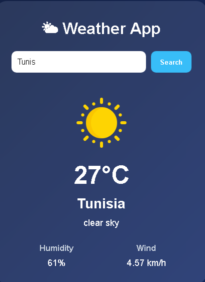

<div align="center">

# 🌤️ Weather App


A sleek, responsive weather application built with **HTML, CSS, and JavaScript**  
powered by the **OpenWeatherMap API**.

</div>

---


---

## 🚀 Live Demo

👉 **[Try it here](https://marzouki-ai.github.io/Weather-App/)**

---

## 📸 Preview

<div align="center">



</div>

---

## ⚡ Features

✨ Search weather by city name  
🌡️ Real-time temperature updates  
💧 Humidity tracking  
🌬️ Wind speed information  
☁️ Dynamic weather icons  
📱 Fully responsive UI  
⚠️ Error handling for invalid inputs  
⏳ Loading animation while fetching data  

---

## 🛠️ Tech Stack

<div align="center">


</div>

---

## 📊 GitHub Analytics

<div align="center">


</div>

---

## 📂 Installation

```bash
# Clone the repository
git clone https://github.com/marzouki-ai/Weather-App.git

# Navigate into the project
cd Weather-App

# Open in browser
open index.html